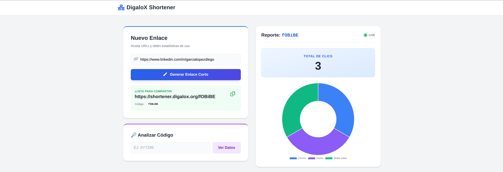
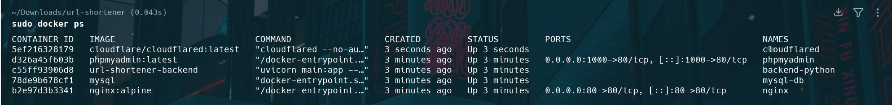
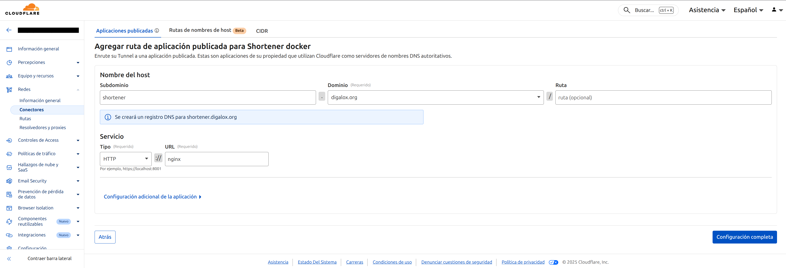

# 🔗 DigaloX Shortener – Infraestructura segura para acortado de URLs

[](https://digalox.org)
[](https://linkedin.com/in/garcialopezdiego)


Sistema de acortamiento de URLs desplegado sobre una arquitectura de microservicios, diseñado con un enfoque claro en **seguridad, aislamiento de red y control de accesos**.


*Panel de control con generación de enlaces y métricas en tiempo real.*

---

## 📑 Índice

- [Características principales](#-características-principales)
- [Seguridad y hardening](#-seguridad-y-hardening)
  - [Segregación de redes](#1-segregación-de-redes)
  - [Principio de mínimo privilegio](#2-principio-de-mínimo-privilegio)
- [Arquitectura del sistema](#-arquitectura-del-sistema)
  - [Componentes](#componentes)
  - [Networking y túneles](#networking-y-túneles)
- [Instalación y despliegue](#-instalación-y-despliegue)
- [Stack tecnológico](#-stack-tecnológico)
- [Autor](#-autor)

---

## ✨ Características principales

- Acortamiento de URLs con persistencia en base de datos
- Métricas y visualización básica
- Arquitectura basada en contenedores Docker
- Base de datos aislada a nivel de red
- Exposición segura mediante Cloudflare Zero Trust
- Sin puertos públicos abiertos en el servidor

---

## 🔐 Seguridad y hardening

El diseño del sistema sigue un enfoque de **defensa en profundidad**, aplicando controles tanto a nivel de red como de base de datos.

### 1. Segregación de redes

La infraestructura utiliza Docker Compose con **dos redes claramente separadas**:

- **Frontend Network**  
  Red donde se sitúan los servicios expuestos: Nginx y Cloudflare Tunnel.

- **Backend Network (internal)**  
  Red interna sin salida al exterior. Aquí residen la API y la base de datos.

La base de datos MySQL **no es accesible desde internet ni desde la red frontend**.  
Aunque un servicio expuesto fuese comprometido, no existiría ruta directa hacia los datos.

---

### 2. Principio de mínimo privilegio

La aplicación no utiliza el usuario `root` de MySQL.

Durante la inicialización:
- Se crea un usuario específico para la aplicación
- Se limitan los permisos a `SELECT`, `INSERT`, `UPDATE` y `DELETE`
- Se eliminan privilegios administrativos como `DROP` o `ALTER`
- Se crean las tablas necesarias para el funcionamiento de la app. Se integra una columna *ip_address* dentro de la tabla *clicks* para posibles integraciones futuras en las estadísticas.

Esto reduce de forma significativa el impacto de posibles errores de programación o inyecciones SQL.

---

## 🏗 Arquitectura del sistema

El sistema está compuesto por varios contenedores que cooperan de forma controlada y aislada.


*Servicios activos y mapeo de redes Docker.*

---

### 🔨 Componentes

1. **Nginx**  
   Actúa como gateway y proxy inverso. Sirve el frontend y redirige las peticiones de la API al backend.

2. **Cloudflare Tunnel**  
   Expone el servicio al dominio público sin necesidad de abrir puertos en el firewall. La IP real del servidor permanece oculta.

3. **Backend (FastAPI)**  
   API REST encargada de la lógica de negocio y el registro de accesos.

4. **MySQL**  
   Almacenamiento persistente mediante volúmenes Docker, accesible únicamente desde la red interna.

---

### 🌐 Networking y túneles

El acceso externo se gestiona mediante **Cloudflare Zero Trust**, eliminando la necesidad de realizar *Port Forwarding* en el router.


*Configuración del túnel vinculando el dominio externo al servicio interno Nginx.*

- **Seguridad perimetral:** El contenedor de Cloudflare establece una conexión saliente cifrada hacia el borde de la red de Cloudflare.
- **Sin puertos abiertos:** No hay puertos de escucha abiertos directamente al internet público en el host, protegiendo la infraestructura de escaneos de red.
- **Resolución interna:** El túnel apunta directamente al nombre de servicio `http://nginx`, resolviendo el tráfico de forma aislada dentro de la red virtual de Docker.
- **Aislamiento de la IP:** La dirección IP real de la infraestructura permanece oculta, ya que todo el tráfico entrante pasa primero por el proxy de Cloudflare.

---

## 🚀 Instalación y despliegue

1. **Clonar el repositorio:**
   ```bash
   git clone [https://github.com/digalox13/digalox-shortener.git](https://github.com/digalox13/digalox-shortener.git)
   cd digalox-shortener
   ```

2. **Configurar variables de entorno:**
   Crea un archivo `.env` en la raíz basándote en los parámetros de configuración definidos en el orquestador:
   ```bash
   MYSQL_ROOT_PASSWORD=tu_password_root
   MYSQL_USER=web_user
   MYSQL_PASSWORD=tu_password_usuario
   MYSQL_DATABASE=shortener_db
   DB_HOST=mysql-db
   TUNNEL_TOKEN=tu_cloudflare_token
   ```

3. **Lanzar la infraestructura:**
   Ejecuta el comando para construir las imágenes y arrancar los servicios en segundo plano:
   ```bash
   docker-compose up -d --build
   ```

---

## 🛠 Stack tecnológico

- **Infraestructura:** Docker y Docker Compose para la orquestación de servicios.
- **Proxy y Redes:** Nginx como proxy inverso y Cloudflare Tunnel para la exposición segura.
- **Backend:** Python 3.9 con FastAPI y Uvicorn para la gestión de la API.
- **Base de Datos:** MySQL 8.0 con gestión vía PhpMyAdmin y privilegios restringidos.
- **Frontend:** Interfaz interactiva construida con HTML5, TailwindCSS y Chart.js para la visualización de analíticas.

---

## 👤 Autor

**Diego García López** - **Portfolio:** [digalox.org](https://digalox.org)  
- **LinkedIn:** [linkedin.com/in/garcialopezdiego](https://linkedin.com/in/garcialopezdiego)  

---
*Este proyecto utiliza una metodología de desarrollo asistido por IA. La arquitectura de sistemas, el diseño de seguridad de redes y la orquestación de contenedores han sido diseñados e implementados por mí. La generación de código (Python/JS) han sido asistidos por Gemini.*

